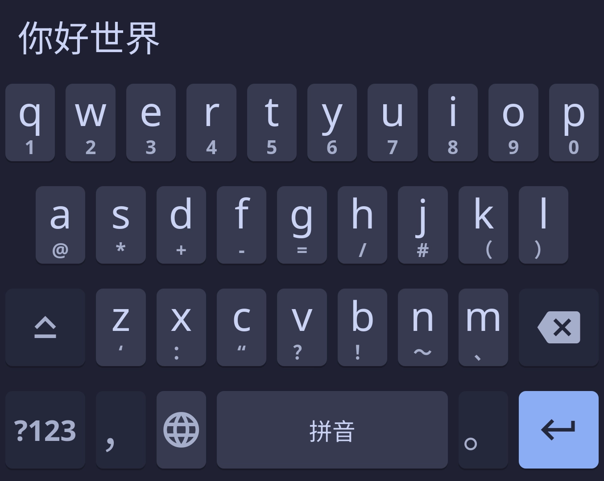

<h3 align="center">
	 
	
	Catppuccin for <a href="https://github.com/fcitx5-android/fcitx5-android">fcitx5-android</a>
	
</h3>

	
	
	

	

## Previews

🌻 Latte

🪴 Frappé

🌺 Macchiato

🌿 Mocha

## Usage

1. Download your flavor of choice from [`themes/`](./themes/).
2. Open fcitx5-android and go to **Theme** > **New theme** > **Import from file...**.
3. Select the downloaded flavor file.

## 💝 Thanks to

- [XYenon](https://github.com/XYenon)

&nbsp;

	

	Copyright &copy; 2021-present <a href="https://github.com/catppuccin" target="_blank">Catppuccin Org</a>

	

